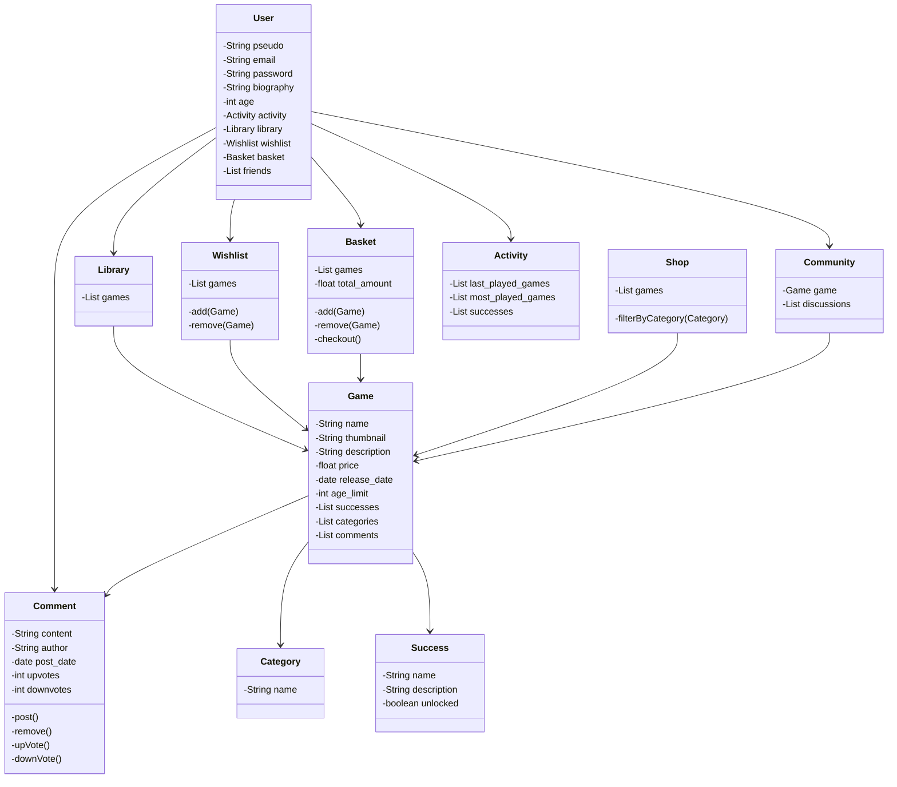

```mermaid
classDiagram
    class User{
        -String pseudo
        -String email
        -String password
        -String biography
        -int age
        -Activity activity
        -Library library
        -Wishlist wishlist
        -Basket basket
        -List<User> friends
    }

    class Game{
        -String name
        -String thumbnail
        -String description
        -float price
        -date release_date
        -int age_limit
        -List<Success> successes
        -List<Category> categories
        -List<Comment> comments
    }

    class Comment{
        -String content
        -String author
        -date post_date
        -int upvotes
        -int downvotes
        -post()
        -remove()
        -upVote()
        -downVote()
    }

    class Library{
        -List<Game> games
    }

    class Wishlist{
        -List<Game> games
        -add(Game)
        -remove(Game)
    }

    class Basket{
        -List<Game> games
        -float total_amount
        -add(Game)
        -remove(Game)
        -checkout()
    }

    class Shop{
        -List<Game> games
        -filterByCategory(Category)
    }

    class Activity{
        -List<Game> last_played_games
        -List<Game> most_played_games
        -List<Success> successes
    }

    class Success{
        -String name
        -String description
        -boolean unlocked
    }

    class Category{
        -String name
    }

    class Community{
        -Game game
        -List<Comment> discussions
    }

    %% Relations
    User --> Library
    User --> Wishlist
    User --> Basket
    User --> Activity
    User --> Comment
    User --> Community

    Library --> Game
    Wishlist --> Game
    Basket --> Game
    Shop --> Game

    Game --> Comment
    Game --> Category
    Game --> Success

    Community --> Game
```
