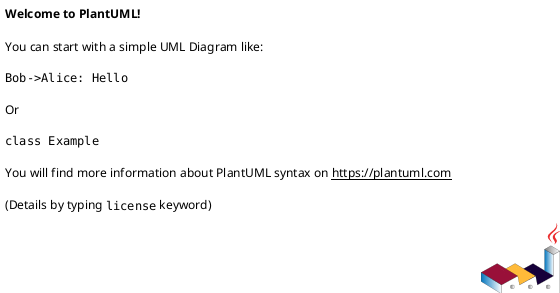

plantuml

Copy

```plantuml
@startumlleft to right directionskinparam packageStyle rectangleskinparam shadowing falseskinparam roundcorner 10actor "Visiteur" as Vactor "Joueur" as Jactor "Studio" as Dactor "Admin Steam" as AV <|-- Jrectangle "Système Steam" {  package "Magasin" {    usecase "Parcourir le catalogue" as UC1    usecase "Filtrer par catégorie" as UC1b    usecase "Afficher le détail d'un jeu" as UC1c    usecase "Ajouter au panier" as UC1d    usecase "Accéder au panier" as UC1e    usecase "Accéder à la liste de souhaits" as UC1f    usecase "Acheter un jeu" as UC2    usecase "Effectuer un paiement" as UC3    usecase "Vérifier l'âge" as UC4    usecase "Consulter actualités/classements" as UC5    usecase "Accéder boutique de points" as UC7    usecase "Recevoir recommandations personnalisées" as UC6  }  package "Bibliothèque & Profil" {    usecase "Accéder à sa bibliothèque" as UC8    usecase "Installer un jeu" as UC9    usecase "Lancer un jeu" as UC10    usecase "Consulter succès/activité" as UC11    usecase "Gérer inventaire & profil" as UC13    usecase "Synchroniser les sauvegardes cloud" as UC12  }  package "Communauté" {    usecase "Participer aux discussions" as UC17    usecase "Accéder au Workshop/Marché" as UC18    usecase "Rejoindre un groupe" as UC21    usecase "Rédiger un avis" as UC22    usecase "Signaler un contenu inapproprié" as UC23  }  package "Gestion & Modération" {    usecase "Publier / Mettre à jour un jeu" as UC27    usecase "Modérer le contenu" as UC29    usecase "Gérer les signalements" as UC30    usecase "Analyser statistiques" as UC31  }}' Relations VisiteurV --> UC1V --> UC1bV --> UC1cV --> UC5V --> UC6' Relations JoueurJ --> UC1dJ --> UC1eJ --> UC1fJ --> UC2J --> UC7J --> UC8J --> UC9J --> UC10J --> UC11J --> UC12J --> UC13J --> UC17J --> UC18J --> UC21J --> UC22J --> UC23' Include / ExtendUC2 ..> UC3 : <<include>>UC1c ..> UC4 : <<include>>UC8 ..> UC9 : <<include>>UC9 ..> UC10 : <<include>>UC1 ..> UC6 : <<extend>>UC22 ..> UC23 : <<include>>' StudioD --> UC27UC27 ..> UC31 : <<include>>' Admin SteamA --> UC29A --> UC30A --> UC31UC30 ..> UC23 : <<include>>@enduml
```